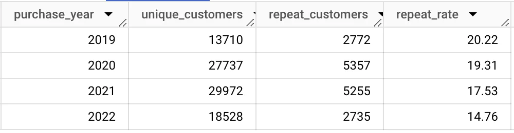
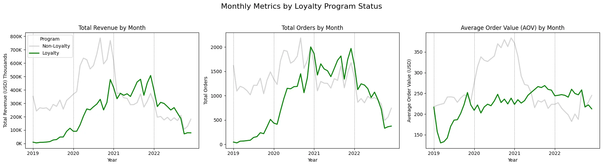

# E-Commerce Data Analysis - Post-Pandemic Business Intelligence

Table of Contents

- [Project Overview](#project-overview)
- [Executive Summary](#executive-summary)
- [Detailed Analysis](#detailed-analysis)
    - [Revenue Patterns and Growth Analysis](#revenue-patterns-and-growth-analysis)
    - [Product Portfolio Performance](#product-portfolio-performance)
    - [Customer Acquisition and Retention Analysis](#customer-acquisition-and-retention-analysis)
    - [Customer Loyalty Program Impact](#customer-loyalty-program-impact)
    - [Platform and Channel Performance](#platform-and-channel-performance)
    - [Return and Refund Analysis](#return-and-refund-analysis)
- [Strategic Recommendations](#strategic-recommendations)
- [Data Considerations and Limitations](#data-considerations-and-limitations)

***

## Project Overview

Elist is a worldwide e-commerce platform established in 2018, focusing on popular consumer electronics including Apple, Samsung, and ThinkPad devices. This analysis collaborates with the Operations leadership team to extract actionable business insights and provide strategic recommendations for enhancing performance across sales, product management, and marketing functions.

## Executive Summary

Our comprehensive analysis of Elist's 108,000 transaction records spanning 2019-2022 reveals that annual revenue has stabilized around $7 million, approaching pre-COVID baseline levels. North America and EMEA markets drive 80% of total sales volume. Computer monitors and AirPods represent 60% of revenue generation, however customer retention metrics indicate concern as new customer acquisition and repeat purchase behaviors have decreased by 15% and 10% respectively. Strategic opportunities exist for Elist to expand high-performing product categories, optimize product bundling strategies, and strengthen customer loyalty initiatives to maximize customer lifetime value. Geographic expansion into APAC and LATAM markets, combined with enhanced digital platform experiences, particularly mobile applications, will position Elist for sustainable long-term growth.

Elist Dataset Entity Relationship Diagram

## Detailed Analysis

### Revenue Patterns and Growth Analysis

- Elist maintains consistent annual revenue of $7 million with approximately 27,000 orders annually.
- Revenue experienced significant growth during 2020 due to pandemic-driven demand but declined 45% by 2022, stabilizing near pre-pandemic baseline as retail environments normalized.
- Clear seasonal patterns emerge with peak performance in November-December and reduced activity in February and October.
- North American and EMEA regions generate 80% of total revenue, with the United States representing 50% of all sales.
- APAC and LATAM markets demonstrated exceptional 200% growth during 2020 but have shown continued volatility.

### Product Portfolio Performance

- Pandemic conditions drove substantial laptop demand, with MacBook orders increasing 400% and ThinkPad sales rising 220%. This trend reversed as post-pandemic conditions normalized.
- Core product categories—monitors, AirPods, laptops, and Samsung Cable Pack—generate 96% of total revenue.
- AirPods represent 45% of all order volume, contributing $7.7M in revenue.
- Computer monitors lead revenue generation at $9.8 million (35% of total sales) across the 2019-2022 period.
- Samsung Cable Pack accounts for 20% of order volume but only 2% of revenue, suggesting low-margin positioning or promotional usage.

### Customer Acquisition and Retention Analysis

- Elist's customer base expanded consistently from 2019 through 2021, reaching nearly 30,000 customers in 2021, followed by a significant 40% decline in 2022.
- Repeat purchase behavior (customers making 2+ orders) consistently declined from 20.22% in 2019 to 14.76% in 2022, highlighting customer retention challenges following initial transactions.
- Core repeat customer numbers remained stable, suggesting a dedicated customer base that maintains consistent multi-purchase behavior annually.
- The simultaneous decline in both new and returning customers during 2022 indicates potential market shifts or evolving customer preferences.

### Customer Loyalty Program Impact

- Loyalty program members complete their initial purchase 20 days faster (30% reduction) compared to non-members (50 days versus 70 days).
- Post-pandemic loyalty performance metrics increased substantially but began moderating by 2022.
- Loyalty members currently outperform in all key business metrics, generating $500K additional revenue, spending $30 more per transaction, and placing 500K more orders than non-loyalty customers.
- The loyalty program shows strong performance in North American markets, while APAC and LATAM regions exhibit volatility, indicating opportunities for region-specific program optimization.
- Loyalty member purchases demonstrate higher refund rates compared to non-loyalty transactions.

### Platform and Channel Performance

- Direct sales channels account for 83% ($23M) of Elist's total revenue.
- Social media contributes 1% of sales volume, while affiliate partnerships generate 3% ($878K).
- Affiliate channels achieve the highest average order value (AOV) at $303, while email marketing campaigns show the lowest AOV at $181.
- Website platform generates 97% ($27M) of sales with $304 AOV, while mobile application performance lags significantly at $867K revenue with $47 AOV.
- Additional channel performance considerations are detailed in the data limitations section.

### Return and Refund Analysis

- Return rates for premium-priced products peaked during early pandemic periods but have stabilized at 4-6%.
- 2021 showed reduced refund activity across all product categories compared to previous years.
- Laptop return rates were highest in 2019-2020 (17%) but have decreased to 6-9%, aligning with other product categories.
- Apple AirPods Headphones show the highest absolute refund volume at 2.6K returns (5% refund rate).
- Loyalty program members exhibit higher refund rates than non-loyalty customers, suggesting an area for further investigation.

## Strategic Recommendations

**Product Portfolio Optimization**

- **Expand Top-Performing Categories**: Diversify monitor, AirPods, and laptop product lines with additional variations and premium options to address varied customer requirements while encouraging repeat purchases and strengthening market position.
- **Optimize Samsung Cable Pack Strategy**: Re-evaluate pricing model for Samsung Cable Pack, consider bundling with higher-value products, or position as promotional incentive to increase average order value and revenue contribution.

***

**Customer Experience and Retention Enhancement**

- **Strengthen Repeat Purchase Initiatives**: Develop personalized re-engagement campaigns targeting single-purchase customers and implement tiered reward structures within the loyalty program to encourage frequent purchasing and improve retention metrics.
- **Diversify Customer Acquisition Channels**: Expand acquisition strategies to include enhanced social media presence, influencer collaborations, and affiliate program growth. Refine messaging to re-engage lapsed customers and attract new customer segments.
- **Leverage High-Value Customer Intelligence**: Analyze purchasing patterns and preferences of repeat customers to enhance loyalty campaign effectiveness. Implement referral incentive programs to drive organic growth and expand customer acquisition through existing networks.

***

**Loyalty Program Enhancement**

- **Optimize Member Onboarding Experience**: Deploy targeted onboarding campaigns featuring first-purchase incentives or exclusive early access opportunities. Develop tiered reward structures to encourage frequent purchasing and strengthen long-term customer relationships.
- **Implement Data-Driven Program Optimization**: Establish continuous monitoring of loyalty performance metrics to refine program features based on analytical insights, ensuring sustained member engagement and program effectiveness.

***

**Quality and Customer Satisfaction**

- **Maintain Excellence in Customer Service**: Continue implementing successful strategies from 2021, including comprehensive product information, rigorous quality assurance processes, and enhanced post-purchase customer support to sustain low return rates and exceed customer expectations.

***

**Channel and Platform Development**

- **Scale Affiliate Partnership Network**: Expand affiliate relationships and enhance commission structures to attract high-performing marketing partners, increasing brand visibility and driving higher average order values.
- **Enhance Mobile Platform Experience**: Improve mobile application checkout processes and personalization capabilities to capitalize on increasing mobile commerce trends and expand mobile platform revenue contribution.

***

**Geographic Market Development**

- **Strengthen High-Performing Regions**: Continue resource allocation to North America and EMEA markets through region-specific marketing initiatives and localized product availability strategies tailored to regional customer preferences.
- **Accelerate Growth in Emerging Markets**: Develop localized partnerships and culturally-relevant promotional strategies to capture growth opportunities in APAC and LATAM markets while stabilizing revenue performance in these developing regions.

***

## Data Considerations and Limitations

### Stakeholder Clarification Requirements

- **Customer ID Data Consistency**
    - Which database table should serve as the authoritative source for `customer_id` to ensure analytical consistency across all business intelligence reports?

- **Marketing Channel and Account Creation Methodology**
    - How is marketing channel data captured and what specific customer touchpoints does it represent?
    - What business factors create the deterministic relationship between these variables?
    - Does `marketing_channel` represent the initial account creation source, or does it track the attribution of individual purchase transactions (which would be more valuable for sales attribution analysis)?

- **Loyalty Program Membership Structure**
    - Is `loyalty_program` status associated with customer accounts or individual transaction records?
    - Can loyalty membership status change between orders for the same customer (subscription-based versus permanent enrollment)?

### Data Quality Assumptions and Limitations

- **Refund Data Completeness**: No refund records exist for 2022, representing an unusual data pattern requiring validation.
- **Deterministic Data Relationships**: Each `marketing_channel` maps exclusively to one `account_creation_method`, indicating a one-to-one relationship. This lack of variation may require data engineering team review to confirm intended business logic.
    - 
- **Loyalty Program Data Ambiguity**:
    - Uncertainty exists regarding `loyalty_program` variable scope—unclear whether it applies to customer accounts or individual transactions.
    - Can customers have loyalty status for some purchases but not others? This clarification is critical for accurate program performance measurement.
- **Channel Attribution Methodology**: Direct and email channels drive primary sales volume, however the relationship between these channels and loyalty program participation remains unclear due to deterministic channel-account-order mapping.
    - **Purchase Attribution to Marketing Channels**: Optimal attribution would assign each purchase to the marketing channel directly responsible for that transaction, rather than defaulting all subsequent purchases to the initial account creation channel. Current dataset reflects account creation entry point rather than individual purchase attribution. Despite this limitation, the data provides valuable insights on loyalty membership by channel:
        - **Email Channel**: Achieves highest loyalty participation rate at 58%.
        - **Direct Channel**: Contains largest loyalty member count with 32,906 members (72% of all loyalty participants).
    - These insights can inform strategic channel investment decisions to optimize loyalty engagement.
- **Customer Record Completeness**: Approximately 27,000 (25%) of transactions contain `customer_id` values not present in the customer database table. This discrepancy suggests data quality issues or data entry errors, creating NULL values when joining customer information in SQL queries.
    - This challenge stems from the segmented database structure (`orders`, `customers`, `geo_lookup`, `order_status` tables). In contrast, Excel analysis using a single consolidated table does not encounter this limitation.

***

<!-- - See the raw data and my cleaning, analysis, and pivot tables in the [Excel workbook](Exploration/elist_ecommerce_analysis.xlsx). -->
- Review SQL analysis queries in the [SQL file](Exploration/ecommerce_exploration.sql).
- Access comprehensive data cleaning, visualization, and statistical analysis in the [Python Notebook](Exploration/ecommerce_analysis.ipynb).

